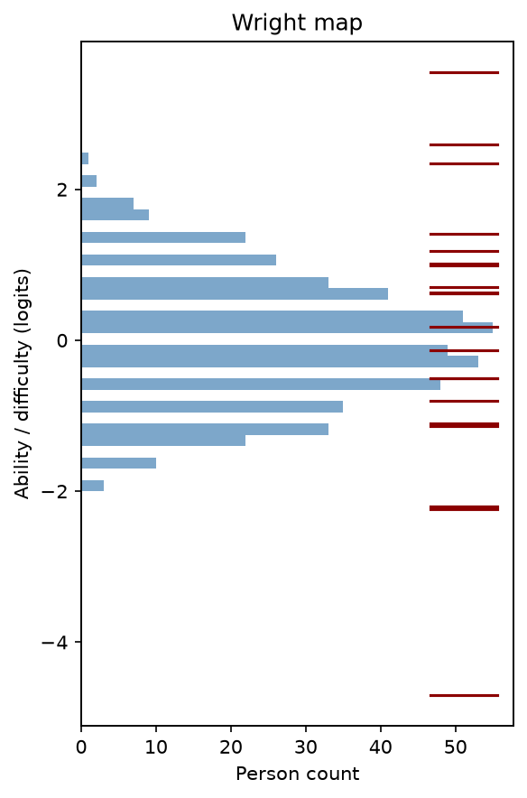
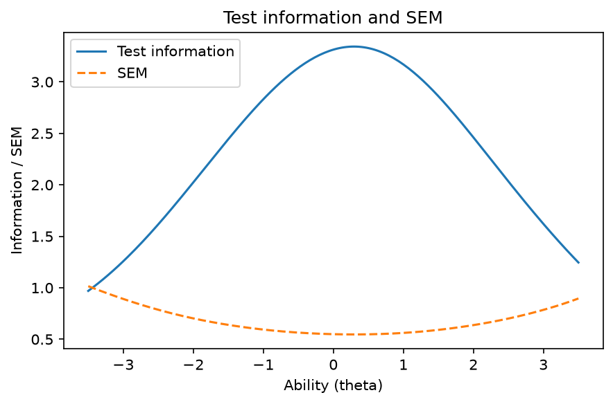
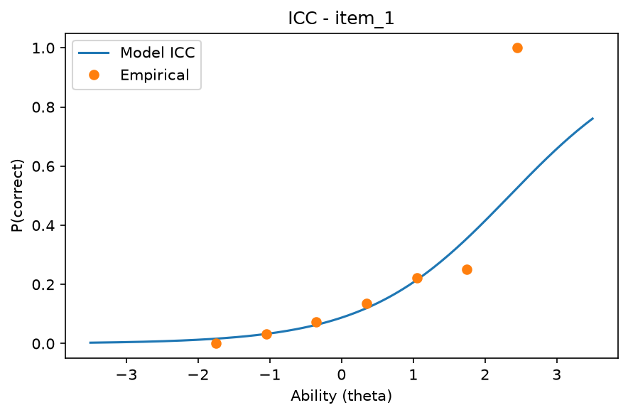
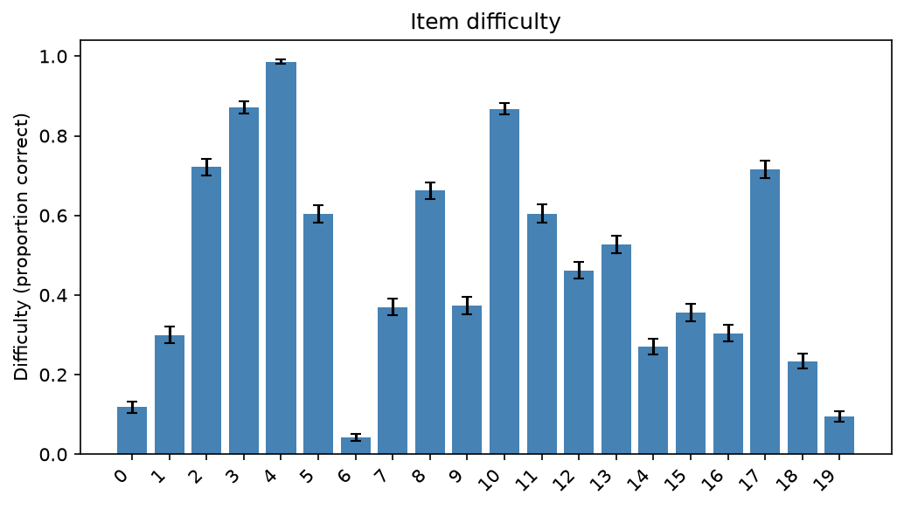
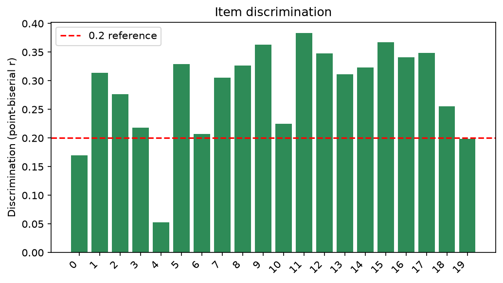
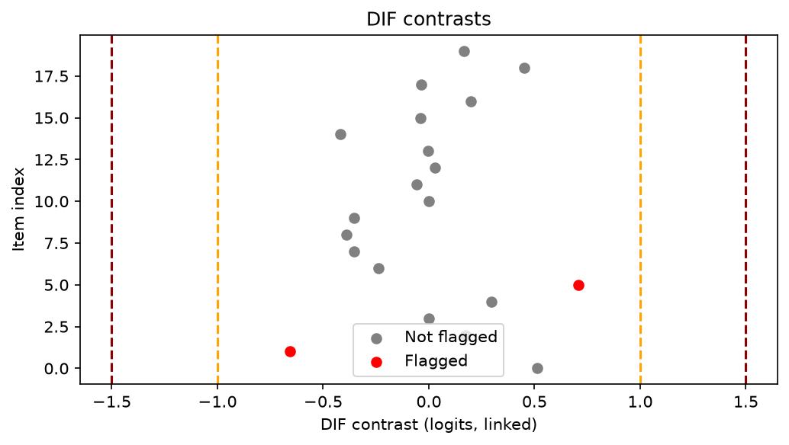

# rasch-per

Rasch model and Classical Test Theory (CTT) psychometric analysis for
education research, built for physics / STEM / discipline-based education
researchers (PER / DBER).

Feed it a CSV of dichotomous (0/1) item responses and get person abilities,
item difficulties, fit statistics, dimensionality checks, DIF analysis, and a
full self-contained HTML validity report.

Status: implemented and validated (119 tests, ~97% coverage). The library is
Beta; the public API is stable for the analyses listed below.

## Quickstart (CLI)

```bash
pip install rasch-per
rasch-per simulate --output demo.csv
rasch-per analyze demo.csv --output report.html
```

`simulate` writes a synthetic response CSV (with a `person_id` index). `analyze`
reads it back (the first column is the person index), runs the full pipeline,
and writes a self-contained HTML report.

```bash
# With differential item functioning (DIF) by a group column
rasch-per analyze demo.csv --groups groups.csv --dif-group gender \
    --reference Man --focal Non-man --output report.html
```

## Python API

```python
import pandas as pd
from rasch_per import (
    ResponseData,
    CTTAnalysis,
    RaschModel,
    DIFAnalysis,
    generate_report,
)

# Load a response matrix (persons as rows, items as columns)
df = pd.read_csv("responses.csv", index_col=0)
data = ResponseData(df)

# Classical Test Theory
ctt = CTTAnalysis(data).run()
print(ctt.summary())
print(ctt.reliability.cronbach_alpha)  # attribute, not a method

# Rasch (MML is the default estimator)
model = RaschModel().fit(data, estimator="MML")
print(model.item_difficulties)  # pandas Series indexed by item name
print(model.fit_statistics())  # infit / outfit mean-squares

# Differential Item Functioning
groups = pd.read_csv("groups.csv", index_col=0)["gender"].reindex(data.person_ids)
dif = DIFAnalysis(model, groups=groups.to_numpy(), reference="Man", focal="Non-man").analyze()
print(dif.summary())  # ETS delta classification + BH flags

# Self-contained HTML validity report
generate_report(
    df,
    output="validity_report.html",
    groups=groups.to_numpy(),
    reference="Man",
    focal="Non-man",
)
```

Notes on the API:

- `generate_report` takes a `pandas.DataFrame`, not a `ResponseData`. When you
  pass `groups`, they must be aligned to the DataFrame's row order (here, the
  person index).
- `CTTResults.reliability` is an attribute (`cronbach_alpha`, `mcdonald_omega`,
  `ferguson_delta`), not a callable.
- `DIFAnalysis` is run with `.analyze()` (it returns a `DIFResults`).

## What's inside

- **CTT**: item difficulty (p-values), discrimination (corrected item-total,
  rest-score based) with bootstrap SEs; Cronbach's alpha, McDonald's omega,
  Ferguson's delta.
- **Rasch**: JML and MML estimation (MML default), standard errors.
- **Fit**: infit/outfit mean-square with low-stakes/high-stakes presets;
  Yen's Q3 local independence check.
- **Dimensionality**: PCAR first-contrast eigenvalue diagnostic.
- **DIF**: Lord's chi-square, mean/mean linking, ETS delta effect sizes,
  Benjamini-Hochberg correction.
- **Report**: single-file HTML validity report with embedded plots.

## Methodology & References

This package implements standard, published psychometric methods used
throughout physics / discipline-based education research:

- Rasch model (Rasch, 1960; Wright & Stone, 1979)
- Joint and marginal maximum likelihood estimation (e.g., as in R packages
  `TAM`, `eRm`)
- Infit/outfit mean-square fit statistics (Smith, 2000; Linacre, 2002)
- Yen's Q3 local independence statistic (Yen, 1984)
- Principal components analysis of residuals (Linacre, 1998)
- Lord's chi-square DIF test (Lord, 1980)
- ETS delta scale DIF classification (ETS categories A/B/C)
- Benjamini-Hochberg false discovery rate control (Benjamini & Hochberg, 1995)
- Cronbach's alpha (Cronbach, 1951), McDonald's omega (McDonald, 1999),
  Ferguson's delta (Ferguson, 1949)

No third-party assessment content or data is included; all examples use
synthetic data from the package's own simulator.

## Documentation & Examples

- API and usage docs: `mkdocs serve` (source in `docsrc/`, requires the
  `docs` extra: `pip install "rasch-per[docs]"`).
- Worked notebooks: `examples/notebooks/quickstart.ipynb` and
  `examples/notebooks/report_walkthrough.ipynb`.
- Optional analyses (PDF export, CFA, Stocking-Lord linking, R cross-validation)
  live in `scripts/` and use the `pdf` / `cfa` extras where needed.

## Screenshots

Key diagnostic plots produced by the package's plotting API on simulated data
(500 persons, 20 items, seed 42):

| Plot | Description |
|------|-------------|
|  | Person ability vs item difficulty (Wright map) |
|  | Test information and standard error of measurement across the ability scale |
|  | Item characteristic curve with empirical overlay (item 1) |
|  | CTT item difficulty with bootstrap standard-error bars |
|  | CTT item point-biserial discrimination |
|  | DIF contrasts with ETS A/B/C classification |

The figures are generated from `simulate_rasch_data` and the analysis pipeline
(CTT, Rasch MML, DIF).

## Development

See [CONTRIBUTING.md](CONTRIBUTING.md). Validation loop: `./.validation.sh`.

## License

MIT
